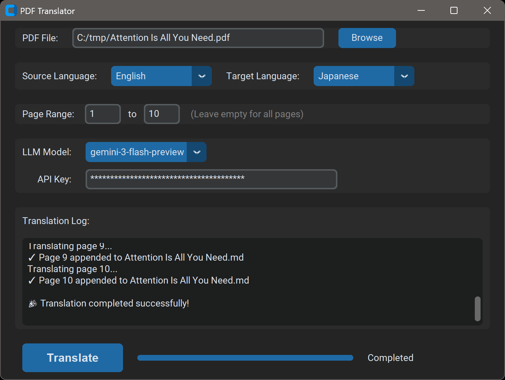
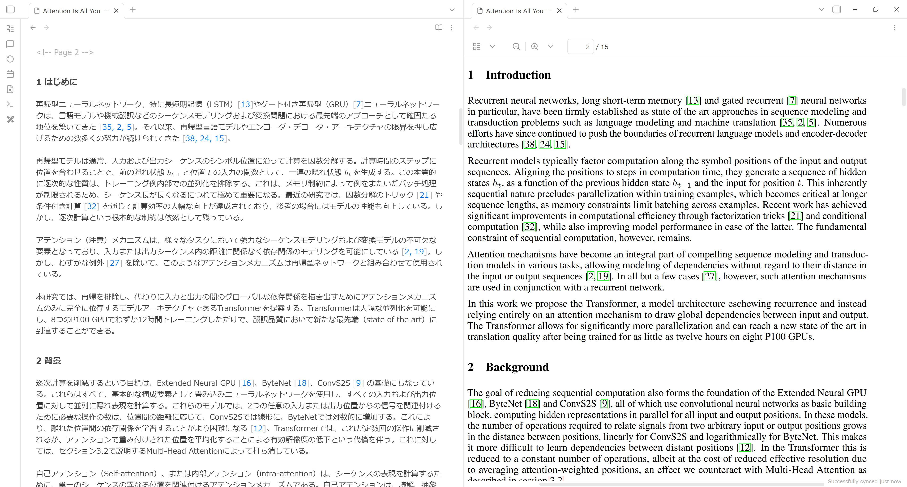

# PDF翻訳デスクトップアプリ

Gemini 3 Flash もしくは OpenAI GPT-5 mini を使用して、PDFファイルを翻訳するデスクトップアプリです。1ページ単位で翻訳してつなげています。PDFファイルの拡張子 .pdf を .md に変えて Markdown 形式で保存します。その際、元の Markdown ファイルに追記します。

[Obsidian](https://obsidian.md/ja/) にて、翻訳した Markdown と元の PDF を左右に並べて表示するのがお勧めです。Markdown 側にコメントを加筆したり文章を修正したりできるのが便利です。

## インストール方法
Python で OS 非依存のプログラムですが、Windows のインストーラーが https://github.com/yukoba/PDFTranslator/releases にあります。

大規模言語モデルのAPIキーが実行するには必要です。以下の場所で手に入ります。
- https://aistudio.google.com/app/apikey
- https://platform.openai.com/api-keys
